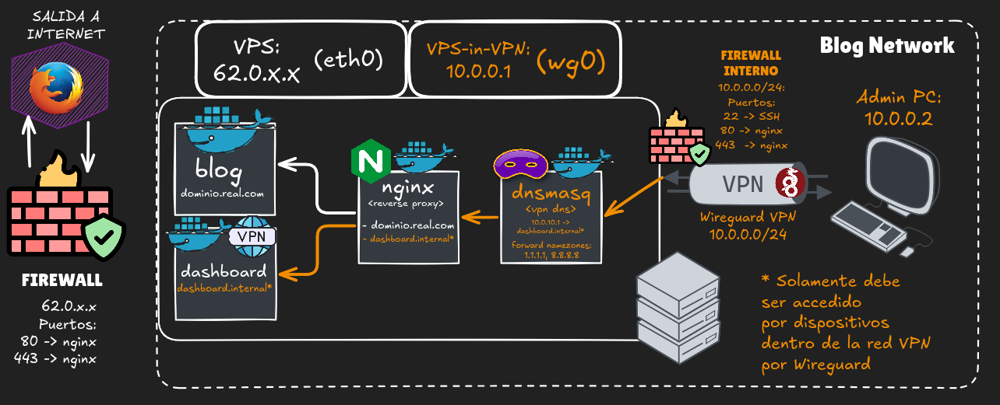

# Infrastructure

## Table of contents

- [Infrastructure](#infrastructure)
  - [Table of contents](#table-of-contents)
  - [Diagram](#diagram)
  - [Technical specifications](#technical-specifications)
    - [Network interfaces](#network-interfaces)
    - [Reverse Proxy: Cases](#reverse-proxy-cases)

## Diagram

The following diagram shows a virtual private server (VPS), hosting an intranet called **"Blog Network"**. There is a public web service exposed to the Internet, an administrative web service accessible only from the Intranet, a reverse proxy that routes traffic to either the public web service or the administrative web dashboard, based on the domain requested by the user; a virtual DNS server for the Intranet with DNS forwarding to upstream resolvers, and a virtual private network (VPN) that provides access to the Intranet.

> [!NOTE]
> There are two network interfaces shown in the diagram: the Internet-facing network interface `(eth0)`, and the **WireGuard** interface for the intranet `(wg0)`.

## Technical specifications

### Network interfaces

- The **WireGuard** interface `(wg0)` is assgined the follwing IP `(10.0.0.1/24)`, and acts as the gateway for the subnet `(10.0.0.0/24)`.
- The Internet-facing interface `(eth0)` has a public IP address assigned.

### Reverse Proxy: Cases

There are three possible scenarios when a user requests access to the following domains:

- `real.domain.com`: Must be accessible from both the Internet and the Intranet.
- `dashboard.internal`: Must be accessible only from the Intranet.
- `Public IP address`: Must not return a response either port 80 or port 443.
